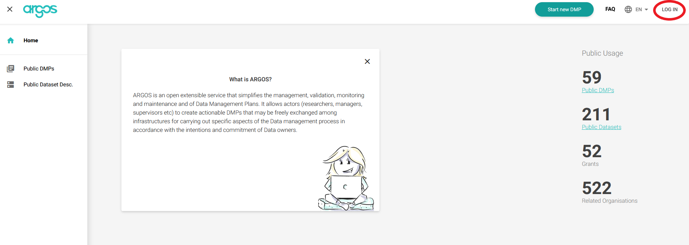
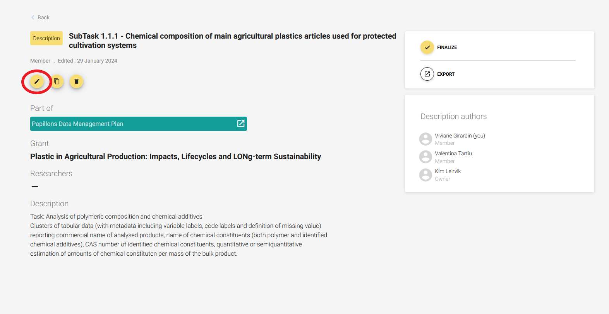
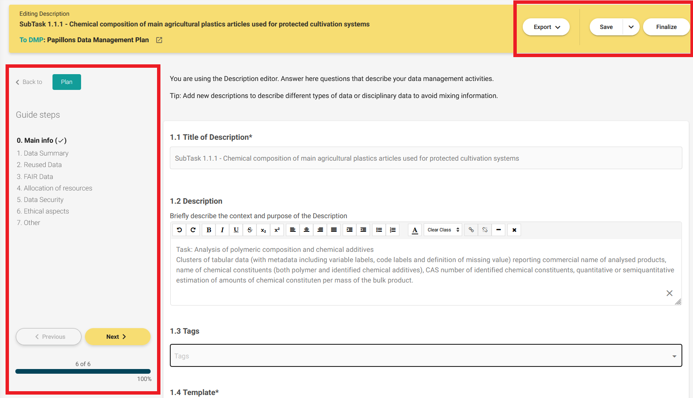

### **_Reminder: Upload your datasets to Zenodo!_**

Data-sharing not only incentivises high-quality research and facilitates information dissemination, but it also required in accordance with the terms and conditions outlined in the Grant Agreement. 

- [PAPILLONS community in Zenodo](https://zenodo.org/communities/papillons/records?q=&l=list&p=1&s=10&sort=newest)

## What is Argos DMP?

[Argos](https://argos.openaire.eu) is an online machine-actionable tool developed by [OpenAIRE](https://www.openaire.eu/) to facilitate Research Data Management (RDM) 

## Why Argos?

-   Collection of dataset descriptions
-   Associated with an activity ("project" or "grant")
-   Can be versioned
-   Exportable to various forms
-   Machine readable (xml, json)
-   Human readable (pdf/openxml)
-   Can be assigned a DOI and published in Zenodo.

[/To be used for Argos- only instructions later/]: # (## Creating a DMP Click on Log in or on Start your DMP on the top right of the page. Either option will take you to the log in option.)

 

## Login

|    |  
| :------- | -----------: |
| 1. Click on Log in on the top right of the page|{width=500px}
| 2. There are several ways to sign in. We recommend using ORCID IDs because:    - **Enhanced Visibility and Credibility:** By linking your ORCID ID to your contributions on platforms like Argos or Zenodo, you enhance the visibility and credibility of your work.  - **Data Integration and Interoperability:** ORCID IDs enable better integration and interoperability of research data across various systems and platforms. When you log in with your ORCID ID, it becomes easier for platforms like Argos or Zenodo to associate your contributions with your unique identifier.  - **Tracking and Managing Contributions:** Using your ORCID ID allows you to easily track and manage your contributions across different platforms. You can view your contributions in one place and ensure they are correctly attributed to you, helping you maintain an accurate record of your scholarly output. - **Compliance:** Many funders and publishers require or encourage researchers to use ORCID IDs for their contributions.|{width=300px}|

 

## Contributing to the PAPILLONS DMP

Each dataset owner or responsible individual must provide information regarding their dataset in the Data Management Plan (DMP). The link to all datasets in the DMP is included in the section [Expected datasets](#jump).
On Argos datasets are called _Description_ (as in _Dataset description_).

|  |  |  
| :------- | :----------- |
|   1. Click on your dataset link that will take you to the DMP.     2. Then click on the edit icon ({width=30px}).     |
|  3. Changes must be saved manually by clicking on **Save** at the top right of the page. It is also possible to export your work for future reference.     4. Once you've completed all necessary steps and reviewed your work, click on **Finalize**.||

 

## Provisional datasets 

Here is a list of expected datasets. The column _datasets name_ has links to each dataset in the DMP

|Task identifier|Description of task|Responsible partners|Generated datasets name (provisional)|Dataset description (provisional)|
|:----|:----|:----|:----|:----|
|SubTask 1.1.1|Analysis of polymeric composition and chemical additives|IPCB_CNR, AUA|[Chemical composition of main agricultural plastics articles used for protected cultivation systems](https://argos.openaire.eu/datasets/overview/a323508a-106d-4316-8589-8ed29c1f607f)|Clusters of tabular data (with metadata including variable labels, code labels and definition of missing value) reporting commercial name of analysed products, name of chemical constituents (both polymer and identified chemical additives), CAS number of identified chemical constituents, quantitative or semiquantitative estimation of amounts of chemical constituten per mass of the bulk product.|
|SubTask 1.1.2|Assessment of functionalities of AP |AUA, UNIBA|[Physical and technical characterization of main agricultural plastics articles used for protected cultivation systems](https://argos.openaire.eu/datasets/overview/e7357682-efdc-437e-bbc6-73f95458ce55)|Clusters of tabular data (with metadata including variable labels, code labels and definition of missing value) reporting commercial name of analysed products, level and typology of ageing of analysed materials, value of measured property.Images of analysed products|
|SubTask 1.2.1| Analysis of degradation and fragmentation of AP and transfer of MNP to soil.| AUA, UNIBA, IPCB_CNR, UBT, NIVA, SYKE, BONN, IMDEA, IHAR, RECETOX| [Morphological and physical chemical characterization of main agricultural plastics articles used for protected cultivation systems during ageing in fields, and collection practices](https://argos.openaire.eu/datasets/overview/cac2c347-a092-427d-b2e5-4447e3f99821)| - Clusters of tabular data (with metadata including variable labels, code labels and definition of missing value) reporting commercial name of analysed products, level and typology of ageing of analysed materials, value of measured property.   - Estimated environmental losses during ageing.   -  Images of analysed products |
|SubTask 1.2.2|End-of-life practices sourcing plastic pollution to soil|AUA, UNIBA, IPCB_CNR, NIVA, UBT | -  [Quantitative and qualitative inventories of end-of life practices for AP](https://argos.openaire.eu/datasets/overview/b8743376-9904-41bc-9535-802b9f5df54e)   - [Images and audiovisual on end of life management practices](https://argos.openaire.eu/datasets/overview/4ee94afe-7643-4386-9688-04b17ca3970d)| - Tabular data (and metadata) listing of observed practices, spatially referenced data of practices, quantitative assessment of plastic tonnages addressed to different practices, rank of practice as a potential source of plastic pollution.   -  Images and audio-visual documenting end of life practices (with metadata), Reports and publications|
|SubTask 1.2.3|Artificial ageing for understanding AP fragmentation mechanisms and rates.|AUA, UNIBA, IPCB_CNR, NIVA, UBT. |[Quantitative (tabular data) and qualitative (text) description of Mulching film degradation in different case studies in Europe](https://argos.openaire.eu/datasets/overview/2efca314-da57-4fbd-8989-b567cef26b7c) | - Clusters of tabular data (with metadata including variable labels, code labels and definition of missing value) reporting concentration in soils of micro and nanoplastics generated from the degradation of mulching films.   - Images and audio-visual documenting end of life practices (with metadata).   - Documents in various formats.   - Reports and publications.|
|SubTask 1.2.4|Release of AP chemical additives during ageing.|IPCB_CNR, AUA|[Quantitative (tabular data) and qualitative (text) description of plastic chemical additives releases](https://argos.openaire.eu/datasets/overview/365cb0cf-8d88-4dc3-8d8a-3ca9ef926657)|- Clusters of tabular data (with metadata including variable labels, code labels and definition of missing value)   -  reporting data of releases of selected chemical additives during ageing of agricultural plastics
|SubTask 1.3.1|Compilation of updated national/regional data on plastics in agricultural production |UNIBA, AUA, SYKE|[Quantitative (tabular data) and qualitative (text) data of agricultural plastic uses in Europe](https://argos.openaire.eu/datasets/overview/d7ad6156-5348-4845-8049-215a8f4fa4cb)| - Clusters of tabular data (with metadata including variable labels, code labels and definition of missing value) reporting georeferenced data of AP plastic uses and management
|SubTask 1.4.1|Production of MNP reference materials |IPCB_CNR, NIVA, NJU, UBT|- [Inventory of micro and nanoplastic reference materials for agriculturalplastic-derived pollution, including chemical and physical characterization](https://argos.openaire.eu/datasets/overview/1ec91359-6036-4fc5-90f2-bd52b4a8c6d9)   -  [Visual documentation of material morphology](https://argos.openaire.eu/datasets/overview/d7ad6e85-c599-46bf-8487-4aa6c6ed14e6)| - Clusters of tabular data (with metadata including variable labels, code labels and definition of missing value)   -  [Images and audio-visual documenting end of life practices (with metadata)
|SubTask 1.4.2|A Harmonisation and further development of methods for the analysis of MNP in soil, water, biota |NIVA, UBT, SYKE |[Protocols for analysis of MNPs in soil samples and organisms](https://argos.openaire.eu/datasets/overview/7c1c8209-3d7f-48d1-8906-fc076d8825fd)|Text files
|SubTask 1.4.3|MNP Standard reference soils for effects MNP behaviour and ecological effect studies |VU, UBT, NIVA, SYKE |- [Inventory of micro and nanoplastic reference materials for agriculturalplastic-derived pollution, including chemical and physical characterization](https://argos.openaire.eu/datasets/overview/e06ecf78-adfa-4eef-b655-3b68ec569b30)   -  [Visual documentation of material morphology](https://argos.openaire.eu/datasets/overview/26de6fc2-d8c5-4d5b-9fd0-e94af1144175)|Clusters of tabular data (with metadata including variable labels, code labels and definition of missing value). Images and audio-visual documenting end of life practices (with metadata)
|Task 2.1|MNP source apportionment in European agricultural soils |UBT, NIVA, AUA SYKE, LUKE, IMDEA, BONN, VU, RECETOX, UNIBA, UCT|[Micro and Nanoplastic contamination in European agricultural soils](https://argos.openaire.eu/datasets/overview/23c3a25d-57cd-4946-9af6-ac759cfa7a16)|Clusters of tabular data (with metadata including variable labels, code labels and definition of missing value) reporting numbers and masses of micro and nanoplastics in European soils (including morphological and chemical composition of particles)
|SubTask 2.2.1|Field plot experiments of MNP behaviour and transport|SYKE, NIVA, LUKE, IMDEA, UBT, BONN, LEI, UCT|[Micro and Nanoplastic contamination and distribution in soils from field plot case studies](https://argos.openaire.eu/datasets/overview/f8c581fa-120f-4bba-be48-e1055d4feec6)|Clusters of tabular data (with metadata including variable labels, code labels and definition of missing value, experimental design description) reporting numbers and masses of micro and nanoplastics in European soils (including morphologic and chemical composition of particles)
|SubTask 2.2.2|Controlled mesocosms studies of MNP behaviour and transport|VU, NIVA, UBT |[Micro and Nanoplastic contamination and distribution in soils from climecs mesocosm experiments](https://argos.openaire.eu/datasets/overview/5e48e2db-1eb4-4a5f-bd6d-de47b30a6c68)|Clusters of tabular data (with metadata including variable labels, code labels and definition of missing value, experimental design description) reporting numbers and masses of micro and nanoplastics in European soils (including morphological and chemical composition of particles)
|SubTask 2.2.3|Behaviour and transport of 14C-nanoplastics in a controlled environment|BONN, SYKE, LUKE, VU, LEI, NJU, FZJ|[Radiolabelled Micro and Nanoplastic distribution in soils from mesocosm studies](https://argos.openaire.eu/datasets/overview/c4a03fe1-ca3d-4690-bf0f-bfe1efe48117)|Clusters of tabular data (with metadata including variable labels, code labels and definition of missing value, experimental design description) reporting quantity of micro and nanoplastics in different soil compartments of mesocosms (estimated through scintillation counting of radiolabelled materials)
|SubTask 2.3.1|Transfer and behaviour of MNP to groundwater and surface water |IMDEA, NIVA, VU, UBT, UKL, UCT. |[Microplastic transport efficiency from runoff experiments](https://argos.openaire.eu/datasets/overview/7a755d0e-df8d-493d-8f7f-df205012e4ee)|Clusters of tabular data (with metadata including variable labels, code labels and definition of missing value, experimental design description) reporting estimators of the transport efficiency of microplastics during runoff experiments
|SubTask 2.3.2|Atmospheric transport of AP| UBT |[Microplastic atmospheric transport data in agricultural areas](https://argos.openaire.eu/datasets/overview/163e306e-fcc8-49ae-b70d-11e4e413c282)|Clusters of tabular data (with metadata including variable labels, code labels and definition of missing value, experimental design description) reporting estimators of the air transport efficiency of microplastics
|SubTask 2.3.3|Uptake of AP-borne MNPs by biota and crops|SYKE, NIVA, LUKE, IMDEA, UBT, VU, UL, BONN, LEI, UCT|[Microplastic and nanoplastics concentration associated to soil biota and crop from C14 experiments](https://argos.openaire.eu/datasets/overview/0e053328-484e-4e07-9e64-81d17d63739b)|Clusters of tabular data (with metadata including variable labels, code labels and definition of missing value, experimental design description)
|Task 3.1|Effects of MNPs on soil physicochemical properties |LUKE, FUB, IMDEA, VU, BONN|[Changes in soil physicalchemical properties after exposure to microplastics](https://argos.openaire.eu/datasets/overview/a79310f9-129a-446d-b424-01debdcd7939)|Clusters of tabular data of values of selected soil physical-chemical properties (with metadata including variable labels, code labels and definition of missing value, experimental design description)
|SubTask 3.2.1|Experiments on MNP effects on microorganism community and functioning|LUKE, FUB, IMDEA, RECETOX, VU, BONN|[Changes microbial community composition and activity from field plot experiments and mesocosms experiments](https://argos.openaire.eu/datasets/overview/004068c0-45e8-4380-a46a-b70d54928161)|Clusters of tabular data of values of molecular markers reflecting microbiota composition and organic matter degradation rates and properties(with metadata including variable labels, code labels and definition of missing value, experimental design description)
|SubTask 3.2.2|Spatial surveys on covariance between microbial diversity and MNP distribution |FUB, LUKE|[Variability in  microbial community composition](https://argos.openaire.eu/datasets/overview/fd87eb4b-30c9-461d-b573-8bc13615b45f)|Clusters of tabular data of values of molecular markers reflecting microbiota composition (with metadata including variable labels, code labels and definition of missing value, experimental design description)
|SubTask 3.3.1|Long-term multigeneration single species tests|SYKE, VU, RECETOX, UBT, UL, UCT|[Toxicological test results on single species (soil invertebrates)](https://argos.openaire.eu/datasets/overview/20cdb990-ee22-478e-b31b-d6ab20b520e5)|Clusters of tabular data of organisms viability (several endpoints)  (with metadata including variable labels, code labels and definition of missing value, experimental design description)
SubTask 3.3.2| Mesocosm experiments|VU, SYKE, UL |[Changes in soil invertebrate communities and properties during mesocosms experiments with added microplastics](https://argos.openaire.eu/datasets/overview/f35ec277-433b-4b1a-a4ef-ad479d53b5f6)|Clusters of tabular data of community composition and population characteristics  (with metadata including variable labels, code labels and definition of missing value, experimental design description)
|SubTask 3.3.3|Field plot experiments and field surveys|IMDEA SYKE, LUKE, VU, UL, BONN |[Changes in soil invertebrate communities and properties during fieldplot experiments with added microplastics](https://argos.openaire.eu/datasets/overview/c55abd7f-1510-4777-b2c1-83c8690bf864)|Clusters of tabular data of community composition and population characteristics  (with metadata including variable labels, code labels and definition of missing value, experimental design description)
|SubTask 4.1.1 |Ecotoxicology of MNPs on plant cells, seeds and emerging plants|LUKE, IHAR, LEI |[Toxicological test results on single plant species](https://argos.openaire.eu/datasets/overview/d8f96469-abb8-4698-9720-3abcb62e22f6)| Clusters of tabular data of plant cell responses, seed germination, plan growth and quality (several endpoints)  (with metadata including variable labels, code labels and definition of missing value, experimental design description)
|SubTask 4.1.2|Plant performance in MNP-Soil-Plant system|LUKE, NIVA, UBT, VU, IHAR, LEI |[_Missing Title_](https://argos.openaire.eu/datasets/overview/62890f1c-3fd3-4978-9203-163d745267b6)| | 
|SubTask 4.1.3|Relevance of environmental factors on MNP-induced effects on plant performance |LUKE, NIVA, IMDEA, UBT, BONN, IHAR, LEI |[Toxicological test results on single plant species in Field plot experiments](https://argos.openaire.eu/datasets/overview/b96c7e58-ca34-4d4c-aef2-1380799b62ca)|Clusters of tabular data of plant growth and qualuty (several endpoints)  (with metadata including variable labels, code labels and definition of missing value, experimental design description)|
|Task 4.2|Socioeconomic sustainability of AP |NIVA, LUKE, IMDEA, BONN, FE |[Data and Result analysis on participated socioeconomic cost benefit analysis from three case studies](https://argos.openaire.eu/datasets/overview/469d70d9-0324-4ba8-b815-d8db8f8c9bb1) |Text files
|Task 5.2|Development and implementation of dissemination and exploitation plan (stake holder scoping)|FE|[Data and Result analysis from stakeholder scoping](https://argos.openaire.eu/datasets/overview/42caf773-0abb-4e4f-a084-4edbb1505c32) |Text files and PowerPoint presentations|
|

## Other datasets

If you wish to add a dataset that is not included on the table above, upload it to our [PAPILLONS community in Zenodo](https://zenodo.org/communities/papillons/records?q=&l=list&p=1&s=10&sort=newest). Instructions on how to upload data to Zenodo can be found [here](https://nivanorge.github.io/instructions-zenodo). 

It is possible to write a comment when you are about to confirm your upload. Make sure to let the data manager know that your upload is not on the list of expected datasets.

|  |  |  
| :------- | :----------- |
On Argos, click on _My descriptions_ on the sidebar on the left of the page||
|Choose the description called _SubTask X.X.X - Template Description for Zenodo Datasets(Click Copy Description)_||
|Create a copy of the template by clicking on the clone button|

**Contact us if you have any questions or suggestions on our [DMP support channel on Teams](https://teams.microsoft.com/l/channel/19%3A718831581f064600909b56c692c91901%40thread.tacv2/DMP%20support%20(Zenodo%20and%20Argos)?groupId=97cca8db-7316-43bf-a8d3-a7a275465cda&tenantId=a7c4c1dd-d500-4316-8296-3dd9569b49d1)!**
