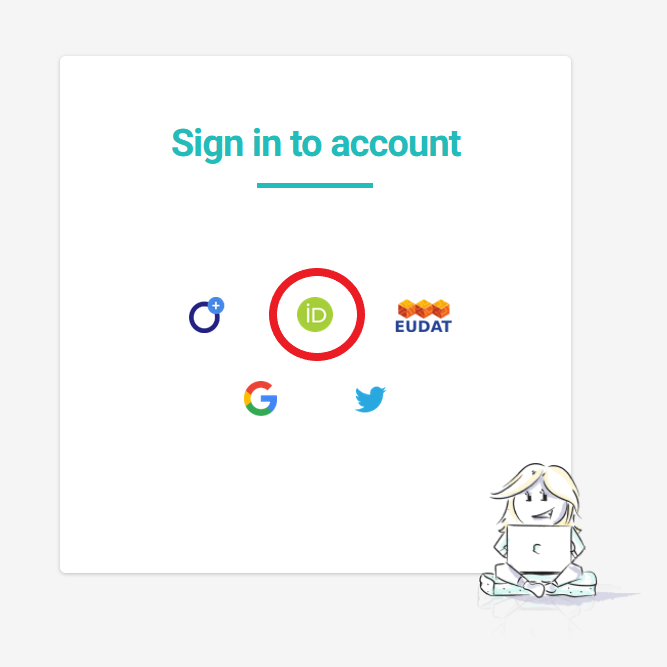

### **_Reminder: Upload your datasets to Zenodo!_**

Data-sharing not only incentivises high-quality research and facilitates information dissemination, but it also required in accordance with the terms and conditions outlined in the Grant Agreement. 

- [NIVA community in Zenodo](https://zenodo.org/communities/niva/)

## What is Argos DMP?

[Argos](https://argos.openaire.eu) is an online machine-actionable tool developed by [OpenAIRE](https://www.openaire.eu/) to facilitate Research Data Management (RDM) 

## Why Argos?

-   Collection of dataset descriptions
-   Associated with an activity ("project" or "grant")
-   Can be versioned
-   Exportable to various forms
-   Machine readable (xml, json)
-   Human readable (pdf/openxml)
-   Can be assigned a DOI and published in Zenodo.

[/To be used for Argos- only instructions later/]: # (## Creating a DMP Click on Log in or on Start your DMP on the top right of the page. Either option will take you to the log in option.)

 

## Login

|    |  
| :------- | -----------: |
| 1. Click on Log in on the top right of the page|{width=500px}
| 2. There are several ways to sign in. We recommend using ORCID IDs because:    - **Enhanced Visibility and Credibility:** By linking your ORCID ID to your contributions on platforms like Argos or Zenodo, you enhance the visibility and credibility of your work.  - **Data Integration and Interoperability:** ORCID IDs enable better integration and interoperability of research data across various systems and platforms. When you log in with your ORCID ID, it becomes easier for platforms like Argos or Zenodo to associate your contributions with your unique identifier.  - **Tracking and Managing Contributions:** Using your ORCID ID allows you to easily track and manage your contributions across different platforms. You can view your contributions in one place and ensure they are correctly attributed to you, helping you maintain an accurate record of your scholarly output. - **Compliance:** Many funders and publishers require or encourage researchers to use ORCID IDs for their contributions.|{width=300px}|

 

## Contributing to an Argos DMP

Each dataset owner or responsible individual must provide information regarding their dataset in the Data Management Plan (DMP). The link to all datasets in the DMP is included in the section [Expected datasets](#jump). 

|  |  |  
| :------- | :----------- |
|   1. Click on your dataset link that will take you to the DMP.     2. Then click on the edit icon ({width=30px}).     |
|  3. Changes must be saved manually by clicking on **Save** at the top right of the page. It is also possible to export your work for future reference.     4. Once you've completed all necessary steps and reviewed your work, click on **Finalize**.||

 

